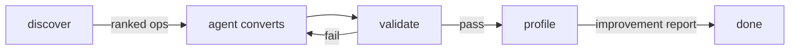

# polarize

Agent-native CLI that discovers compute-heavy pandas operations and validates their Polars conversions.

## Why

Migrating pandas to Polars is tedious and error-prone. An agent can do it — but it needs to know **what to convert first** (highest impact), **whether the conversion is correct** (equivalence check), and **how much faster it got** (benchmarks). polarize gives agents exactly that.

## How it works



1. **Discover** — parses your Python files via AST, finds pandas operations, and ranks them by compute weight (loop-aware, impact-sorted)
2. **Validate** — checks syntax, confirms polars import, and runs both scripts to assert equivalent output
3. **Profile** — benchmarks time and peak memory across N runs, reports improvement percentages

The agent drives the loop: discover the highest-impact operation, convert it, validate, profile, repeat.

## Install

Requires Python 3.10+ and [uv](https://docs.astral.sh/uv/).

```bash
uv pip install -e ".[dev]"
```

## Usage

### CLI

```bash
# Find compute-heavy pandas operations (highest impact first)
polarize discover script.py --threshold high

# Validate a conversion produces equivalent output
polarize validate --original script.py --converted script_polars.py -- arg1 arg2

# Benchmark the improvement
polarize profile --original script.py --converted script_polars.py --runs 5 -- arg1 arg2

# List all supported operations and their weights
polarize ops
```

### Python API

```python
from polarize import discover, validate, profile

report = discover("script.py", threshold="high")
# -> ranked operations with suggested_conversion_order

result = validate("script.py", "script_polars.py", script_args=["input.csv"])
# -> {"status": "pass"|"fail", "checks": [...]}

perf = profile("script.py", "script_polars.py", runs=5)
# -> time/memory metrics with improvement percentages
```

## For agents

polarize is built for agents, not humans. All output is structured JSON. The typical agent loop:

1. Call `polarize discover` to get operations ranked by impact
2. Convert the top-ranked operation to Polars
3. Call `polarize validate` to confirm correctness
4. Call `polarize profile` to measure improvement
5. Repeat with `--threshold medium` then `--threshold low`

See [GUIDE.md](GUIDE.md) for the full agent workflow reference.

## License

MIT
